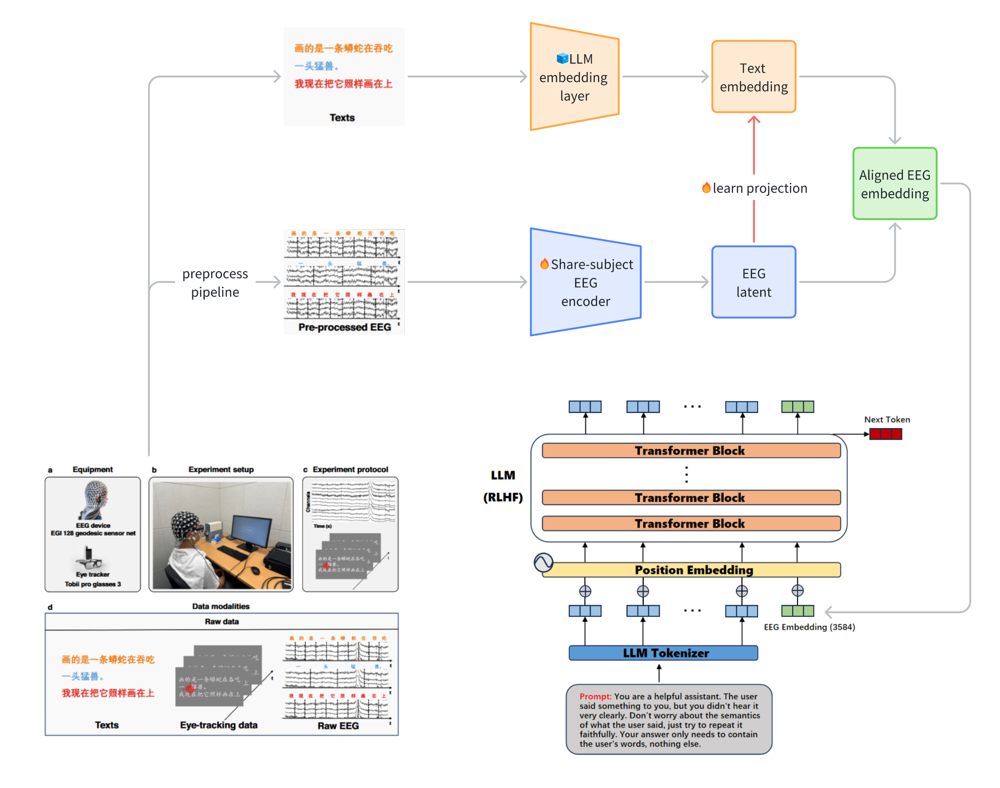

# The official implement of LLMs Help Alleviate the Cross-Subject Variability in Brain Signal and Language Alignment



| [<br /><sub>arnoliudaxia</sub>](https://github.com/arnoliudaxia) | [<br /><sub>SHTechBoBo</sub>](https://github.com/SHTechBoBo) | [<br /><sub>Shuhang Li</sub>](https://github.com/coding1daxia) |
|----------------------------------------------------------------------------------------------------|----------------------------------------------------------------------------------------------------|----------------------------------------------------------------------------------------------------|


## Environmental setup

```
pip install -r requirements.txt
```


## Dataset

You should prepare the dataset via the ChineseNeuro Symphony community (CHNNeuro) in Science Data Bank platform ([https://doi.org/10.57760/sciencedb.CHNNeuro.00007](https://doi.org/10.57760/sciencedb.CHNNeuro.00007)) or via Openneuro ([https://openneuro.org/datasets/ds004952](https://openneuro.org/datasets/ds004952)).**

Because of copyright limitations, we cannot offer our processed data version here. Once you have downloaded the original dataset, you should use the processing script `Chinese_reading_task_eeg_processing/data_preprocessing_and_alignment/align_eeg_with_sentence.py` found at "https://github.com/arnoliudaxia/Chinese_reading_task_eeg_processing.git". Please note that we have made some modifications to the original processing code.

## Input and Output

Original Dataset: This dataset includes EEG signals collected as a person reads several sentences, with each sentence linked to EEG signals recorded across 128 channels with variable sample lengths.

1. Initially, we divided each sentence by the number of characters to match each character with its corresponding EEG signal.
2. We then trained an autoencoder for the EEG signals, compressing the multi-channel signals from shape (128, t) to (1, 64), resulting in a latent variable for each character.
3. Subsequently, we utilized the tokenizer from qwen2-7b (Alibaba's Tongyi Qianwen model) to convert each character into a token, creating final pairs of (token, latent), where the token is shaped (1,) as a single number, and the latent is shaped (1, 64) as a vector.

Dataset files are formatted like `Data/qwen-characterSplit/sub04/run_1_with_latent_tokenid.pkl`, with the reading code located in `util/getAllData.py`.

Output: "Reconstruct" a Chinese character.

## Directory Structure

| Path                             | Description                     |
|----------------------------------|---------------------------------|
| readme.md                        | Documentation file              |
| Data/qwen-characterSplit/        | Dataset                         |
| Model/dataloader.py              | PyTorch Dataloader (allows masking of certain subjects) |
| util                             | Contains some potentially useful functions |

## Core Experiments

To run the experiments, use the following command structure:

```
PYTHONPATH=$(pwd) python Experiment/Dataset/autoencoder4EEG-inference.py
```

- `My/Experiment/Dataset` includes algorithms for processing data.
- `My/Experiment/AutoEncoder/autoencoder4EEG.py` is the EEGencoder model designed to extract a low-dimensional latent representation.

For data acquisition, ensure to modify:
```
Chinese_reading_task_eeg_processing/data_preprocessing_and_alignment/align_eeg_with_sentence.py
```

To train the autoencoder, execute:
```
PYTHONPATH=$(pwd) python My/Experiment/AutoEncoder/autoencoder4EEG.py --batchSize 4096 --SaveModelPath My/Model/AutoEncoder/mask8_12_6 --UseWandb --lr 1e-4 --mask 8 12 6
```

To perform inference on the test subject using the trained autoencoder, run:
```
PYTHONPATH=$(pwd) python My/Experiment/Dataset/autoencoder4EEG-inference.py --model_path <Trained Model Path> --mask 12 6 8
```

Once the latent variables for the test subject are obtained via autoencoder inference, train the text embedding mapping:
```
PYTHONPATH=$(pwd) python My/Experiment/latent2Embedding/latent2embed.py --SaveModelPath My/Model/latent2Embedding  --lr 1e-4 --UseWandb
```

Finally, use `My/Experiment/InsertEmbedding/embedingInsertQwen.ipynb` to integrate the predicted EEG embedding into the LLM.

## Overall Concept

1. **EEG Signal Preprocessing:**
   - Begin by preprocessing the EEG data to filter out noise and enhance signal quality.
   - Segment the EEG signals to ensure they align with the corresponding language stimuli, extracting features for each segment.

2. **Mapping EEG to BERT Input Embedding Space:**
   - Develop a deep neural network to map EEG features into the BERT input embedding space.
   - Implement an encoder network to transform EEG features into dimensions compatible with BERT embeddings. This could involve a multilayer perceptron (MLP), or more advanced architectures like CNNs or RNNs to capture temporal patterns.

3. **Loss Function Design:**
   - Use cosine similarity loss to align EEG features with language embeddings in a similar vector space.
   - Employ contrastive learning to ensure EEG features and BERT embeddings from the same stimulus are similar, while those from different stimuli are distinct.

4. **Training Process:**
   - Use paired data where each EEG segment corresponds to a language stimulus for supervised training, mapping EEG signals to the BERT embedding space.
   - During training, input EEG signals, generate vectors through the network, and calculate their similarity with the corresponding BERT embeddings.

5. **Language Decoding:**
   - After training, input new EEG signals into the network to produce BERT embeddings.
   - Use a BERT model or similar decoding mechanism to convert these embeddings back into text, identifying the most probable language stimuli.

6. **Evaluation:**
   - Assess the quality of language outputs using metrics like BLEU and ROUGE.
   - Evaluate the mapping effectiveness of EEG signals to language embeddings using accuracy or similarity metrics.


## run history

```

--mask 8

PYTHONPATH=$(pwd) python My/Experiment/AutoEncoder/autoencoder4EEG.py --batchSize 8192 --SaveModelPath My/Model/AutoEncoder/mask8 --UseWandb --mask 8

PYTHONPATH=$(pwd) python My/Experiment/Dataset/autoencoder4EEG-inference.py --model_path My/Model/AutoEncoder/mask8/best_eeg_autoencoder.pth --mask 8 --latentSize 2048


PYTHONPATH=$(pwd) python My/Experiment/latent2Embedding/latent2embed.py --mask 8 --LossType ContrastiveLoss --UseWandb --note Contrast欠采样学习率调度e3 --batchSize 4096 --lr 1e-3

PYTHONPATH=$(pwd) python My/Experiment/latent2Embedding/latent2embed.py --mask 8 --LossType ContrastiveLoss --UseWandb --note Contrast欠采样学习率调度e4 --batchSize 4096 --lr 1e-4

PYTHONPATH=$(pwd) python My/Experiment/latent2Embedding/latent2embed.py --mask 8  --UseWandb --note MSE欠采样学习率调度e3 --batchSize 4096 --lr 1e-3

PYTHONPATH=$(pwd) python My/Experiment/latent2Embedding/latent2embed.py --mask 8  --LossType  Euclidean --UseWandb --note 欧几里得欠采样学习率调度e4 --batchSize 4096 --lr 1e-4


PYTHONPATH=$(pwd) python My/Experiment/latent2Embedding/latent2embed.py --mask 8 --LossType ContrastiveLoss --batchSize 4096 --lr 1e-3


PYTHONPATH=$(pwd) python My/Experiment/latent2Embedding/latent2embed.py --SaveModelPath My/Model/latent2Embedding/MLP --mask 8 --UseWandb

PYTHONPATH=$(pwd) python My/Experiment/latent2Embedding/latent2embed.py --SaveModelPath My/Model/latent2Embedding/MLP --mask 8 --lr 1e-6 --UseWandb


PYTHONPATH=$(pwd) python My/util/save_embed.py --model_path My/Model/latent2Embedding/latent_to_embed_model_sub08.pth --output_path My/Data/yhw/mask8 --mask 8


PYTHONPATH=$(pwd) python My/util/save_embed.py --model_path My/Model/latent2Embedding/MLPAndContrastiveloss/latent_to_embed_model_sub08.pth --output_path My/Data/yhw/mask8 --mask 8


PYTHONPATH=$(pwd) python My/Experiment/latent2Embedding/latent2embed_searchHyper.py


--mask 6 10 13 14

6_10_13_14

PYTHONPATH=$(pwd) python My/Experiment/AutoEncoder/autoencoder4EEG.py --batchSize 8192 --SaveModelPath My/Model/AutoEncoder/mask6_10_13_14 --UseWandb --mask 6 10 13 14

PYTHONPATH=$(pwd) python My/Experiment/Dataset/autoencoder4EEG-inference.py --model_path My/Model/AutoEncoder/mask6_10_13_14/best_eeg_autoencoder.pth --mask 6 10 13 14


PYTHONPATH=$(pwd) python My/Experiment/latent2Embedding/latent2embed.py --SaveModelPath My/Model/latent2Embedding --UseWandb --mask 6 10 13 14

PYTHONPATH=$(pwd) python My/util/save_embed.py --model_path My/Model/latent2Embedding/latent_to_embed_model_sub08_sub12_sub06.pth --output_path My/Data/yhw/mask6_12_8 --mask 6 8 12

```